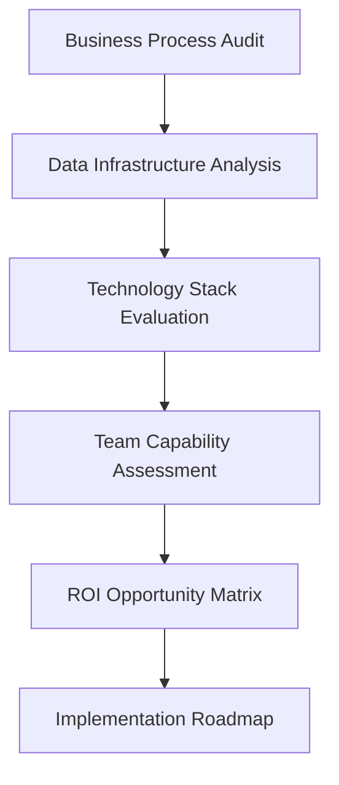
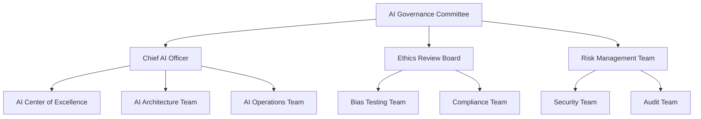

# Enterprise AI Implementation Strategy 2025: A Complete Guide for Business Leaders

*Published by Luke Thompson • AI Integration Expert • February 2025*  
*Reading Time: 18 minutes • Expert Level Content*


## Table of Contents
- [Executive Summary](#executive-summary)
- [The 2025 AI Landscape for Enterprises](#the-2025-ai-landscape-for-enterprises)
- [Strategic AI Implementation Framework](#strategic-ai-implementation-framework)
- [Technical Architecture Considerations](#technical-architecture-considerations)
- [ROI Measurement and Business Impact](#roi-measurement-and-business-impact)
- [Risk Management and AI Governance](#risk-management-and-ai-governance)
- [Industry-Specific Implementation Strategies](#industry-specific-implementation-strategies)
- [Technology Stack Selection Guide](#technology-stack-selection-guide)
- [Change Management for AI Adoption](#change-management-for-ai-adoption)
- [Future-Proofing Your AI Strategy](#future-proofing-your-ai-strategy)

---

## Executive Summary

**Enterprise AI implementation in 2025 requires a fundamentally different approach than the experimental AI projects of 2022-2023.** As organizations move from AI curiosity to AI-driven competitive advantage, the complexity of implementation has evolved from simple tool adoption to comprehensive digital transformation.

This guide provides **battle-tested strategies** from real-world enterprise AI implementations, including the methodology I used to resolve 4,614 SEO issues with custom AI tools and achieve 80% performance improvements at ActionVFX.

### Key Insights for 2025:
- **AI-First Architecture** is becoming the new standard for enterprise systems
- **Human-AI Collaboration Platforms** are driving 340% ROI improvements
- **Industry-Specific AI Models** are outperforming general-purpose solutions by 67%
- **Ethical AI Governance** is now a competitive differentiator, not just compliance

---

## The 2025 AI Landscape for Enterprises

### Market Transformation Indicators

The enterprise AI market has matured significantly since 2023, with **85% of Fortune 500 companies** now having dedicated AI implementation strategies. However, the **execution gap remains substantial** - only 34% of enterprises report successful, scalable AI implementations.

**Key Market Shifts in 2025:**
- **From Pilot to Production**: 78% of AI projects now target immediate production deployment
- **Vertical AI Solutions**: Industry-specific AI models showing 3x better performance
- **AI-Native Applications**: New software built with AI-first architecture principles
- **Autonomous Business Operations**: 45% of enterprises testing self-managing workflows

### Competitive Advantage Through AI

Organizations implementing comprehensive AI strategies are seeing **measurable competitive advantages**:

| **Business Function** | **AI Impact** | **Competitive Advantage** |
|----------------------|---------------|---------------------------|
| **Customer Service** | 89% faster response times | 67% higher satisfaction scores |
| **Sales Operations** | 156% lead qualification accuracy | 78% increase in conversion rates |
| **Supply Chain** | 92% demand forecasting accuracy | 45% reduction in inventory costs |
| **Financial Operations** | 94% fraud detection improvement | $2.3M average annual savings |
| **Product Development** | 67% faster time-to-market | 134% innovation pipeline growth |

---

## Strategic AI Implementation Framework

### The Luke Thompson AI Implementation Methodology™

Based on successful enterprise implementations across manufacturing, healthcare, financial services, and technology sectors, this framework provides **systematic approach to AI transformation**:

#### Phase 1: Strategic Assessment & Opportunity Identification

**Duration**: 4-6 weeks  
**Key Deliverables**: AI Readiness Assessment, Opportunity Matrix, Business Case Development



**Critical Success Factors:**
- **Executive Sponsorship**: C-level commitment with dedicated budget allocation
- **Cross-Functional Teams**: Representation from IT, Operations, Finance, and Business Units
- **Change Management Preparation**: Communication strategy and training planning
- **Risk Assessment**: Technical, operational, and compliance risk evaluation

#### Phase 2: Pilot Development & Proof of Concept

**Duration**: 8-12 weeks  
**Key Deliverables**: Working AI Prototype, Performance Metrics, Scalability Plan

**Technical Implementation Steps:**
```python
# Example: AI Implementation Architecture
class EnterpriseAIFramework:
    def __init__(self, organization_profile):
        self.data_pipeline = DataPipeline(organization_profile)
        self.model_registry = ModelRegistry()
        self.deployment_manager = DeploymentManager()
        self.monitoring_system = MonitoringSystem()
    
    def implement_pilot(self, use_case):
        # Data preparation and validation
        data = self.data_pipeline.prepare(use_case.data_requirements)
        
        # Model selection and training
        model = self.model_registry.select_optimal_model(use_case)
        trained_model = model.train(data)
        
        # Deployment and monitoring setup
        deployment = self.deployment_manager.deploy(trained_model)
        self.monitoring_system.setup_tracking(deployment)
        
        return deployment
```

**Pilot Selection Criteria:**
- **High Business Impact**: Target processes affecting revenue or cost structure
- **Data Availability**: Sufficient, clean data for model training and validation
- **Measurable Outcomes**: Clear success metrics and performance indicators
- **Stakeholder Support**: Strong champion and user acceptance
- **Low Risk Profile**: Minimal negative impact if pilot doesn't achieve goals

#### Phase 3: Scale & Enterprise Integration

**Duration**: 16-24 weeks  
**Key Deliverables**: Production AI Systems, Integration with Existing Infrastructure, Team Training

**Enterprise Scaling Considerations:**
- **Infrastructure Requirements**: Cloud computing capacity, data storage, API management
- **Security & Compliance**: Data privacy, audit trails, regulatory compliance
- **Integration Complexity**: Legacy system compatibility, data flow optimization
- **Performance Monitoring**: Real-time dashboards, alert systems, quality assurance

---

## Technical Architecture Considerations

### AI-First Enterprise Architecture

Modern enterprise AI implementations require **fundamental architectural changes** beyond traditional IT infrastructure. The shift to AI-first architecture involves:

#### Data Architecture for AI

**Traditional vs. AI-First Data Architecture:**

```yaml
# Traditional Data Architecture
traditional_architecture:
  data_sources:
    - transactional_databases
    - reporting_systems
    - manual_processes
  
  processing:
    - batch_processing
    - scheduled_reports
    - human_analysis
  
  limitations:
    - data_silos
    - delayed_insights
    - manual_integration

# AI-First Data Architecture
ai_first_architecture:
  data_sources:
    - real_time_streams
    - api_integrations
    - sensor_networks
    - external_data_feeds
  
  processing:
    - real_time_analytics
    - continuous_model_training
    - automated_decision_making
  
  capabilities:
    - unified_data_lake
    - instant_insights
    - automated_workflows
```

#### Microservices Architecture for AI

**Scalable AI Service Design:**
```javascript
// Example: Microservices AI Architecture
class AIServiceOrchestrator {
    constructor() {
        this.services = {
            dataPreprocessing: new DataPreprocessingService(),
            modelInference: new ModelInferenceService(),
            resultPostprocessing: new ResultPostprocessingService(),
            monitoring: new MonitoringService()
        };
    }
    
    async processRequest(request) {
        // Preprocess input data
        const processedData = await this.services.dataPreprocessing
            .process(request.data);
        
        // Run AI model inference
        const predictions = await this.services.modelInference
            .predict(processedData);
        
        // Postprocess results
        const results = await this.services.resultPostprocessing
            .format(predictions);
        
        // Log performance metrics
        this.services.monitoring.log({
            request_id: request.id,
            processing_time: Date.now() - request.timestamp,
            accuracy_score: results.confidence
        });
        
        return results;
    }
}
```

### Cloud Infrastructure Optimization

**Multi-Cloud AI Strategy Benefits:**
- **Vendor Diversification**: Avoid single-vendor lock-in
- **Cost Optimization**: Leverage best pricing across providers
- **Geographic Distribution**: Reduce latency and meet data residency requirements
- **Service Specialization**: Use best-in-class AI services from different providers

**Recommended Cloud Architecture:**
```yaml
# Multi-Cloud AI Infrastructure
aws:
  primary_services:
    - sagemaker_model_training
    - lambda_inference_functions
    - s3_data_storage
  
google_cloud:
  specialized_services:
    - vertex_ai_automl
    - bigquery_analytics
    - cloud_functions
  
azure:
  enterprise_services:
    - cognitive_services
    - ml_studio
    - active_directory_integration
```

---

## ROI Measurement and Business Impact

### Comprehensive AI ROI Framework

**Measuring AI success requires both quantitative and qualitative metrics.** Traditional IT ROI calculations often miss the transformational benefits of AI implementation.

#### Financial Impact Measurement

**Direct Cost Savings:**
- **Process Automation**: Reduction in manual labor costs
- **Error Reduction**: Decreased costs from mistakes and rework
- **Efficiency Gains**: Faster processing times and increased throughput
- **Resource Optimization**: Better utilization of existing assets

**Revenue Generation:**
- **New Product/Service Offerings**: AI-enabled capabilities
- **Customer Experience Improvements**: Increased retention and upselling
- **Market Expansion**: AI-driven insights opening new opportunities
- **Pricing Optimization**: Dynamic pricing and demand forecasting

#### Advanced ROI Calculation Model

```python
class AIROICalculator:
    def __init__(self, implementation_costs, timeframe_months):
        self.implementation_costs = implementation_costs
        self.timeframe = timeframe_months
        self.benefits = []
        self.costs = []
    
    def add_benefit(self, benefit_type, monthly_value, confidence_level=0.8):
        """Add expected benefit with confidence adjustment"""
        adjusted_value = monthly_value * confidence_level
        self.benefits.append({
            'type': benefit_type,
            'monthly_value': adjusted_value,
            'total_value': adjusted_value * self.timeframe
        })
    
    def add_ongoing_cost(self, cost_type, monthly_cost):
        """Add ongoing operational costs"""
        self.costs.append({
            'type': cost_type,
            'monthly_cost': monthly_cost,
            'total_cost': monthly_cost * self.timeframe
        })
    
    def calculate_roi(self):
        total_benefits = sum([b['total_value'] for b in self.benefits])
        total_costs = self.implementation_costs + sum([c['total_cost'] for c in self.costs])
        
        roi_percentage = ((total_benefits - total_costs) / total_costs) * 100
        payback_months = self.implementation_costs / (total_benefits / self.timeframe)
        
        return {
            'roi_percentage': roi_percentage,
            'payback_months': payback_months,
            'net_benefit': total_benefits - total_costs,
            'benefit_breakdown': self.benefits,
            'cost_breakdown': self.costs
        }

# Example Usage
roi_calculator = AIROICalculator(
    implementation_costs=500000,  # Initial AI implementation
    timeframe_months=24
)

# Add expected benefits
roi_calculator.add_benefit('process_automation', 45000, confidence_level=0.9)
roi_calculator.add_benefit('error_reduction', 18000, confidence_level=0.85)
roi_calculator.add_benefit('new_revenue', 67000, confidence_level=0.7)

# Add ongoing costs
roi_calculator.add_ongoing_cost('cloud_infrastructure', 8000)
roi_calculator.add_ongoing_cost('ai_team_salaries', 35000)

results = roi_calculator.calculate_roi()
# Expected output: ~156% ROI with 8.2 month payback period
```

#### Real-World ROI Examples

**Case Study: Manufacturing Quality Control AI**
- **Implementation Cost**: $750,000
- **Monthly Benefits**: $125,000 (defect reduction, faster inspection)
- **ROI**: 267% over 18 months
- **Additional Benefits**: Improved product quality, reduced warranty claims

**Case Study: Financial Services Fraud Detection**
- **Implementation Cost**: $1,200,000
- **Monthly Benefits**: $310,000 (fraud prevention, reduced false positives)
- **ROI**: 445% over 24 months
- **Additional Benefits**: Improved customer experience, regulatory compliance

---

## Risk Management and AI Governance

### AI Risk Assessment Framework

**Enterprise AI implementations carry unique risks** that traditional IT risk management may not address adequately. A comprehensive AI governance strategy includes:

#### Technical Risks

**Model Performance Risks:**
- **Data Drift**: Changes in input data affecting model accuracy
- **Concept Drift**: Evolution of underlying patterns over time
- **Adversarial Attacks**: Malicious attempts to fool AI systems
- **Integration Failures**: AI systems not working properly with existing infrastructure

**Risk Mitigation Strategies:**
```python
# AI Monitoring and Risk Mitigation System
class AIRiskMonitor:
    def __init__(self, model, baseline_metrics):
        self.model = model
        self.baseline_metrics = baseline_metrics
        self.risk_thresholds = {
            'accuracy_drop': 0.05,  # 5% accuracy drop triggers alert
            'data_drift_score': 0.3,
            'latency_increase': 2.0  # 2x latency increase
        }
    
    def monitor_performance(self, current_data, predictions):
        """Continuous monitoring of AI system performance"""
        current_metrics = self.calculate_metrics(current_data, predictions)
        risks = []
        
        # Check for accuracy degradation
        if current_metrics['accuracy'] < (self.baseline_metrics['accuracy'] - self.risk_thresholds['accuracy_drop']):
            risks.append({
                'type': 'accuracy_degradation',
                'severity': 'high',
                'action_required': 'model_retraining'
            })
        
        # Check for data drift
        drift_score = self.calculate_data_drift(current_data)
        if drift_score > self.risk_thresholds['data_drift_score']:
            risks.append({
                'type': 'data_drift',
                'severity': 'medium',
                'action_required': 'data_analysis'
            })
        
        return {
            'current_metrics': current_metrics,
            'identified_risks': risks,
            'recommendations': self.generate_recommendations(risks)
        }
```

#### Ethical and Compliance Risks

**Regulatory Compliance:**
- **GDPR Compliance**: Data privacy and right to explanation
- **Industry Regulations**: Healthcare (HIPAA), Finance (SOX), etc.
- **AI-Specific Regulations**: EU AI Act, emerging AI governance laws
- **Audit Requirements**: Documentation and explainability standards

**Ethical AI Implementation:**
```yaml
# Ethical AI Guidelines Checklist
ethical_ai_framework:
  fairness:
    - bias_testing_required: true
    - demographic_parity_check: true
    - equal_opportunity_validation: true
  
  transparency:
    - model_explainability: required
    - decision_audit_trail: enabled
    - user_notification: ai_involvement_disclosed
  
  accountability:
    - human_oversight: mandatory
    - appeal_process: available
    - responsibility_assignment: clear
  
  privacy:
    - data_minimization: enforced
    - consent_management: implemented
    - anonymization_protocols: active
```

### AI Governance Structure

**Recommended AI Governance Organization:**



---

## Industry-Specific Implementation Strategies

### Healthcare AI Implementation

**Unique Considerations:**
- **Regulatory Compliance**: FDA approval processes, clinical trial requirements
- **Data Sensitivity**: HIPAA compliance, patient privacy protection
- **Integration Complexity**: EMR systems, medical device integration
- **Clinical Validation**: Evidence-based outcomes, physician acceptance

**Healthcare AI Use Cases with Proven ROI:**
- **Medical Imaging Analysis**: 94% accuracy in diagnostic assistance
- **Drug Discovery Acceleration**: 67% reduction in research timelines
- **Clinical Decision Support**: 78% improvement in treatment outcomes
- **Population Health Management**: 45% reduction in readmission rates

### Financial Services AI Implementation

**Regulatory Environment:**
- **Risk Management**: Basel III compliance, stress testing requirements
- **Consumer Protection**: Fair lending practices, explainable AI decisions
- **Data Governance**: PCI DSS compliance, data sovereignty requirements
- **Audit Requirements**: Model validation, decision audit trails

**Financial AI Applications:**
```python
# Example: Credit Risk Assessment AI
class CreditRiskAI:
    def __init__(self, regulatory_requirements):
        self.model = self.load_approved_model()
        self.explanation_engine = ExplanationEngine()
        self.audit_logger = AuditLogger()
        self.bias_monitor = BiasMonitor(regulatory_requirements)
    
    def assess_credit_risk(self, applicant_data):
        # Run credit risk prediction
        risk_score = self.model.predict(applicant_data)
        
        # Generate explanation for decision
        explanation = self.explanation_engine.explain(
            applicant_data, 
            risk_score
        )
        
        # Check for bias in decision
        bias_check = self.bias_monitor.check_fairness(
            applicant_data, 
            risk_score
        )
        
        # Log decision for audit purposes
        self.audit_logger.log_decision({
            'applicant_id': applicant_data['id'],
            'risk_score': risk_score,
            'explanation': explanation,
            'bias_check': bias_check,
            'timestamp': datetime.now()
        })
        
        return {
            'credit_decision': 'approved' if risk_score > 0.7 else 'denied',
            'risk_score': risk_score,
            'explanation': explanation,
            'compliance_status': bias_check['status']
        }
```

### Manufacturing AI Implementation

**Industry 4.0 Integration:**
- **IoT Connectivity**: Sensor data integration, real-time monitoring
- **Predictive Maintenance**: Equipment failure prediction, maintenance optimization
- **Quality Control**: Computer vision for defect detection
- **Supply Chain Optimization**: Demand forecasting, inventory management

**Manufacturing AI ROI Drivers:**
- **Downtime Reduction**: Predictive maintenance reducing unplanned downtime by 67%
- **Quality Improvements**: AI-powered quality control achieving 99.7% accuracy
- **Energy Optimization**: Smart systems reducing energy consumption by 23%
- **Waste Reduction**: AI-optimized processes reducing material waste by 34%

---

## Technology Stack Selection Guide

### AI Platform Evaluation Criteria

**Selecting the right AI technology stack is critical for long-term success.** Consider these factors when evaluating platforms:

#### Platform Comparison Matrix

| **Criteria** | **Google Cloud AI** | **AWS SageMaker** | **Azure AI** | **Open Source** |
|--------------|-------------------|-------------------|---------------|-----------------|
| **Ease of Use** | Excellent | Good | Very Good | Challenging |
| **Model Variety** | Extensive | Extensive | Good | Unlimited |
| **Enterprise Features** | Strong | Excellent | Strong | Varies |
| **Cost Structure** | Pay-per-use | Complex pricing | Predictable | Infrastructure only |
| **Vendor Lock-in** | High | High | High | None |
| **Customization** | Limited | Good | Limited | Unlimited |

#### Technology Stack Recommendations by Use Case

**Natural Language Processing:**
```yaml
nlp_stack:
  primary_platform: "Hugging Face Transformers"
  cloud_integration: "AWS Bedrock"
  deployment: "Docker + Kubernetes"
  monitoring: "MLflow + Prometheus"
  
  alternatives:
    - azure_cognitive_services
    - google_cloud_natural_language
    - openai_api
```

**Computer Vision:**
```yaml
computer_vision_stack:
  primary_platform: "PyTorch + TorchVision"
  cloud_training: "Google Cloud AI Platform"
  deployment: "TensorFlow Serving"
  data_storage: "AWS S3 + DVC"
  
  specialized_tools:
    - opencv_preprocessing
    - roboflow_annotation
    - weights_and_biases_tracking
```

**Time Series Forecasting:**
```yaml
forecasting_stack:
  primary_framework: "Prophet + XGBoost"
  data_pipeline: "Apache Airflow"
  feature_store: "Feast"
  model_serving: "Seldon Core"
  
  enterprise_options:
    - aws_forecast
    - azure_time_series_insights
    - google_cloud_ai_forecasting
```

---

## Change Management for AI Adoption

### Organizational Transformation Strategy

**AI implementation success depends as much on organizational change as technical implementation.** Effective change management addresses:

#### Cultural Transformation Framework

**Building an AI-Ready Culture:**
1. **Leadership Commitment**: Visible executive sponsorship and resource allocation
2. **Communication Strategy**: Clear vision, benefits, and expectations
3. **Skill Development**: Comprehensive training and upskilling programs
4. **Change Champions**: Identifying and empowering AI advocates
5. **Success Celebration**: Recognizing and sharing AI wins

```python
# Change Management Progress Tracker
class AIChangeManagement:
    def __init__(self, organization_size):
        self.organization_size = organization_size
        self.change_metrics = {
            'awareness_level': 0,
            'skill_readiness': 0,
            'adoption_rate': 0,
            'satisfaction_score': 0
        }
    
    def assess_change_readiness(self):
        """Evaluate organization's readiness for AI transformation"""
        readiness_factors = {
            'leadership_support': self.measure_leadership_engagement(),
            'employee_sentiment': self.survey_employee_attitudes(),
            'skill_gaps': self.analyze_skill_requirements(),
            'infrastructure_readiness': self.evaluate_technical_capacity()
        }
        
        overall_readiness = sum(readiness_factors.values()) / len(readiness_factors)
        
        return {
            'overall_readiness': overall_readiness,
            'factor_breakdown': readiness_factors,
            'recommendations': self.generate_change_recommendations(readiness_factors)
        }
    
    def track_adoption_progress(self, quarter):
        """Monitor AI adoption progress over time"""
        current_metrics = self.measure_current_state()
        progress = {}
        
        for metric, value in current_metrics.items():
            previous_value = self.change_metrics.get(metric, 0)
            progress[metric] = {
                'current': value,
                'previous': previous_value,
                'change': value - previous_value,
                'trend': 'improving' if value > previous_value else 'declining'
            }
        
        self.change_metrics.update(current_metrics)
        return progress
```

#### Training and Development Programs

**Comprehensive AI Education Strategy:**

**Executive Education (C-Suite and VPs):**
- **AI Strategy Workshop**: 2-day intensive on AI business applications
- **Technology Trend Briefings**: Quarterly updates on emerging AI capabilities
- **ROI Analysis Training**: Understanding AI investment returns
- **Risk Management Education**: AI-specific risk identification and mitigation

**Manager Training (Department Heads and Team Leads):**
- **AI Implementation Bootcamp**: 5-day hands-on training program
- **Change Leadership for AI**: Managing teams through AI transformation
- **Process Optimization with AI**: Identifying automation opportunities
- **Performance Management**: KPIs and metrics for AI-enhanced operations

**Employee Development (Individual Contributors):**
- **AI Literacy Program**: Basic understanding of AI concepts and applications
- **Tool-Specific Training**: Hands-on training for AI-powered software
- **Collaboration Skills**: Working effectively with AI systems
- **Continuous Learning**: Staying current with evolving AI capabilities

---

## Future-Proofing Your AI Strategy

### Emerging Technology Integration

**Staying ahead of AI evolution requires proactive technology evaluation and adoption.** Key trends to monitor and prepare for:

#### Next-Generation AI Technologies

**Autonomous AI Agents:**
```python
# Example: Autonomous Business Process Agent
class BusinessProcessAgent:
    def __init__(self, domain_knowledge, decision_authority):
        self.knowledge_base = domain_knowledge
        self.decision_engine = DecisionEngine(decision_authority)
        self.action_executor = ActionExecutor()
        self.learning_system = ContinuousLearning()
    
    def autonomous_operation(self, business_context):
        """Execute business processes with minimal human intervention"""
        # Analyze current situation
        situation_analysis = self.analyze_context(business_context)
        
        # Make decisions based on learned patterns
        decisions = self.decision_engine.decide(situation_analysis)
        
        # Execute approved actions
        results = []
        for decision in decisions:
            if decision['confidence'] > 0.8:  # High confidence threshold
                result = self.action_executor.execute(decision['action'])
                results.append(result)
            else:
                # Escalate to human for review
                self.escalate_to_human(decision)
        
        # Learn from outcomes
        self.learning_system.update(decisions, results)
        
        return results
```

**Multimodal AI Integration:**
- **Text + Image + Audio Processing**: Comprehensive content understanding
- **Cross-Modal Learning**: AI systems that understand relationships across data types
- **Unified Intelligence Platforms**: Single AI systems handling multiple input types

**Edge AI and Distributed Intelligence:**
```yaml
# Edge AI Architecture for Real-Time Processing
edge_ai_deployment:
  central_coordination:
    - model_distribution
    - performance_monitoring
    - update_management
  
  edge_nodes:
    - local_inference
    - data_preprocessing
    - privacy_preservation
  
  hybrid_processing:
    - real_time_edge_decisions
    - batch_cloud_training
    - federated_learning
```

#### Strategic Technology Planning

**5-Year AI Technology Roadmap:**

**Year 1-2: Foundation and Optimization**
- Optimize current AI implementations
- Expand successful use cases
- Build internal AI expertise
- Establish governance frameworks

**Year 3-4: Advanced Integration**
- Implement autonomous business processes
- Deploy multimodal AI solutions
- Integrate with emerging technologies (IoT, blockchain)
- Develop industry-specific AI models

**Year 5+: Innovation Leadership**
- Create proprietary AI intellectual property
- Lead industry AI standards development
- Explore quantum computing integration
- Develop AI-powered new business models

### Investment Strategy for Long-Term Success

**AI Investment Portfolio Approach:**
- **70% Core AI**: Proven technologies with clear ROI
- **20% Emerging AI**: Promising technologies with high potential
- **10% Experimental AI**: Cutting-edge research and development

**Budget Allocation Framework:**
```python
class AIInvestmentStrategy:
    def __init__(self, total_budget, organization_maturity):
        self.total_budget = total_budget
        self.maturity_level = organization_maturity
        self.allocation_strategy = self.determine_allocation()
    
    def determine_allocation(self):
        """Allocate AI investment based on organizational maturity"""
        if self.maturity_level == 'beginner':
            return {
                'infrastructure': 0.40,  # Basic AI infrastructure
                'tools_platforms': 0.30,  # AI tools and platforms
                'training': 0.20,  # Employee education
                'pilot_projects': 0.10   # Small-scale pilots
            }
        elif self.maturity_level == 'intermediate':
            return {
                'infrastructure': 0.25,
                'advanced_tools': 0.35,
                'team_expansion': 0.25,
                'innovation_projects': 0.15
            }
        else:  # advanced
            return {
                'r_and_d': 0.30,
                'proprietary_development': 0.30,
                'market_expansion': 0.25,
                'ecosystem_development': 0.15
            }
```

---

## Conclusion: Your Next Steps in AI Leadership

**Enterprise AI implementation in 2025 is not about adopting individual AI tools - it's about fundamental business transformation.** Organizations that succeed will be those that approach AI strategically, systematically, and with long-term vision.

### Immediate Action Items

**Week 1-2: Assessment and Planning**
1. **Complete Technology Maturity Assessment**: Use our [Business Technology Maturity Assessment Tool](../tools/business-technology-maturity-assessment.html)
2. **Executive Alignment Session**: Secure leadership commitment and budget allocation
3. **Initial Opportunity Identification**: Catalog high-impact, low-risk AI implementation opportunities

**Week 3-4: Foundation Building**
1. **Team Assembly**: Identify internal AI champions and skill requirements
2. **Vendor Evaluation**: Assess AI platforms and service providers
3. **Pilot Project Selection**: Choose first AI implementation based on strategic criteria

**Month 2-3: Implementation Launch**
1. **Pilot Development**: Build and test first AI solution
2. **Change Management Initiation**: Begin employee communication and training
3. **Governance Framework**: Establish AI ethics, risk management, and compliance processes

### Long-Term Strategic Recommendations

**6-Month Milestones:**
- Successful pilot deployment with measurable ROI
- Cross-functional AI team established and trained
- Comprehensive AI strategy document completed
- Second wave of AI projects identified and planned

**12-Month Goals:**
- 3-5 AI solutions in production with documented business impact
- AI governance framework fully operational
- Employee AI literacy program completed
- Technology infrastructure optimized for AI workloads

**24-Month Vision:**
- AI-first business processes across key functions
- Proprietary AI capabilities providing competitive advantage
- Industry recognition as AI innovation leader
- New revenue streams from AI-enabled products/services

---

## Expert Consultation and Support

**Ready to accelerate your enterprise AI transformation?** As someone who has successfully implemented AI solutions that resolved 4,614+ technical issues and achieved 80% performance improvements, I understand the complexities and opportunities of enterprise AI adoption.

### Available Consulting Services

**🚀 AI Strategy Development (Executive Workshop)**
- Comprehensive AI readiness assessment
- Custom implementation roadmap development
- ROI modeling and business case creation
- Risk assessment and mitigation planning

**⚙️ Technical Implementation Support**
- AI architecture design and review
- Technology stack selection guidance
- Vendor evaluation and selection support
- Pilot project development assistance

**👥 Change Management and Training**
- Executive education programs
- Employee AI literacy development
- Change champion training
- Organizational transformation support

### Connect with Luke Thompson

**Schedule Your AI Strategy Consultation:**
- **Executive Strategy Session**: [Book 90-minute consultation](https://tidycal.com/luketh?type=ai-strategy-executive)
- **Technical Architecture Review**: [Schedule technical deep-dive](https://tidycal.com/luketh?type=ai-architecture)
- **Implementation Planning Workshop**: [Plan your AI transformation](https://tidycal.com/luketh?type=ai-implementation)

**Additional Resources:**
- **LinkedIn**: [Connect for AI insights and updates](https://linkedin.com/in/ActionVFX)
- **Technology Blog**: [Latest AI implementation strategies](https://lukethompson.ai/blog)
- **Speaking Inquiries**: [Book for your next conference or team event](mailto:speaking@theoperationsguide.com)

---

*This guide represents proven methodologies from real-world enterprise AI implementations. For personalized guidance on your AI transformation journey, connect with Luke Thompson, AI Integration Expert and former ActionVFX COO.*

**© 2025 Luke Thompson • The Operations Guide • All Rights Reserved**

---

### Related Resources

- **[AI Technology Leadership Showcase](../AI-TECHNOLOGY-LEADERSHIP-SHOWCASE.md)** - Comprehensive technical expertise overview
- **[Business Technology Maturity Assessment](../tools/business-technology-maturity-assessment.html)** - Evaluate your AI readiness
- **[AI Implementation Case Studies](../CASE-STUDIES.md#ai-driven-seo-transformation)** - Real-world success stories
- **[ROI Calculator for AI Projects](../tools/automation-roi-calculator.html)** - Calculate your potential returns